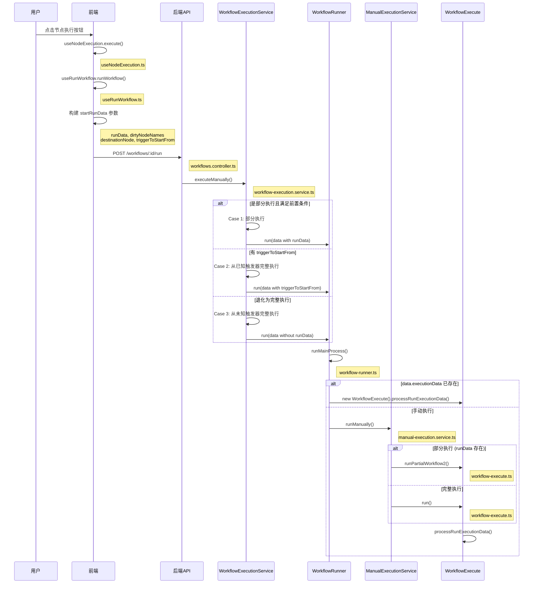

# n8n 部分执行与完整手动执行流程分析

## 一、前端请求参数分析

当用户在画布上点击执行某个非触发节点时，前端会通过 `useRunWorkflow.ts` 中的 `runWorkflow` 函数构建以下参数发送给后端：

### 1.1 参数构建逻辑（前端）

**核心构建位置**：[useRunWorkflow.ts](file:///c:/Users/10244/Desktop/0508-under/n8n/packages/frontend/editor-ui/src/app/composables/useRunWorkflow.ts#L340-L378)

| 参数 | 类型 | 说明 | 构建逻辑 |
|------|------|------|----------|
| `runData` | `IRunData` \| `undefined` | 已有的节点执行数据 | 部分执行时发送完整 runData；完整执行时为 `undefined` |
| `dirtyNodeNames` | `string[]` \| `undefined` | 需要重新执行的脏节点列表 | 从 `dirtinessByName` 中筛选出标记为脏的节点 |
| `destinationNode` | `IDestinationNode` | 目标节点信息 | `{ nodeName: string, mode: 'inclusive' \| 'exclusive' }` |
| `triggerToStartFrom` | `{ name: string; data?: ITaskData }` \| `undefined` | 指定从哪个触发器开始 | 仅在用户选择了特定触发器时设置 |
| `startNodes` | `StartNodeData[]` | 起点节点列表 | 通过 `consolidateRunDataAndStartNodes` 计算得出 |

### 1.2 关键参数构建代码片段

```typescript
// 部分执行标记
const isPartialExecution = options.destinationNode !== undefined;

const startRunData: IStartRunData = {
    workflowId: workflowData.id!,
    runData: isPartialExecution
        ? (runData ?? undefined)  // 部分执行发送runData
        : undefined,              // 完整执行不发送runData
    startNodes,
    triggerToStartFrom,
    chatSessionId: options.sessionId,
};

if ('destinationNode' in options) {
    startRunData.destinationNode = options.destinationNode;
}

// 脏节点筛选
if (startRunData.runData) {
    const nodeNames = Object.entries(dirtinessByName.value).flatMap(([nodeName, dirtiness]) =>
        dirtiness ? [nodeName] : [],
    );
    startRunData.dirtyNodeNames = nodeNames.length > 0 ? nodeNames : undefined;
}
```

### 1.3 请求发送

**发送位置**：[workflows.store.ts](file:///c:/Users/10244/Desktop/0508-under/n8n/packages/frontend/editor-ui/src/app/stores/workflows.store.ts#L748-L765)

```typescript
async function runWorkflow(startRunData: IStartRunData): Promise<IExecutionPushResponse> {
    return await makeRestApiRequest(
        rootStore.restApiContext,
        'POST',
        `/workflows/${startRunData.workflowId}/run`,
        startRunData as unknown as IDataObject,
    );
}
```

---

## 二、后端执行类型判断逻辑

### 2.1 请求类型定义

**定义位置**：[workflow.request.ts](file:///c:/Users/10244/Desktop/0508-under/n8n/packages/cli/src/workflows/workflow.request.ts#L34-L62)

后端将手动执行请求分为三种类型：

```typescript
// 1. 从已知触发器完整执行
type FullManualExecutionFromKnownTriggerPayload = {
    triggerToStartFrom: { name: string; data?: ITaskData };
    destinationNode?: IDestinationNode;
    // ...
};

// 2. 从未知触发器完整执行
type FullManualExecutionFromUnknownTriggerPayload = {
    destinationNode: IDestinationNode;
    // 无 runData，无 triggerToStartFrom
};

// 3. 部分执行到目标节点
type PartialManualExecutionToDestinationPayload = {
    runData: IRunData;
    destinationNode: IDestinationNode;
    dirtyNodeNames: string[];
};
```

### 2.2 类型守卫判断

**判断位置**：[workflow-execution.service.ts](file:///c:/Users/10244/Desktop/0508-under/n8n/packages/cli/src/workflows/workflow-execution.service.ts#L562-L593)

```typescript
// 部分执行：同时有 destinationNode 和 runData
function isPartialExecution(payload): boolean {
    return 'destinationNode' in payload && 'runData' in payload;
}

// 从已知触发器完整执行：有 triggerToStartFrom
function isFullExecutionFromKnownTrigger(payload): boolean {
    return 'triggerToStartFrom' in payload;
}

// 从未知触发器完整执行：既没有 triggerToStartFrom 也没有 runData
function isFullExecutionFromUnknownTrigger(payload): boolean {
    if ('triggerToStartFrom' in payload) return false;
    return !('runData' in payload);
}
```

### 2.3 部分执行前置条件检查

**检查位置**：[workflow-execution.service.ts](file:///c:/Users/10244/Desktop/0508-under/n8n/packages/cli/src/workflows/workflow-execution.service.ts#L537-L553)

部分执行需要满足两个前置条件，不满足则退化为完整手动执行：

```typescript
private partialExecutionFulfilsPreconditions(
    workflowData: IWorkflowBase,
    payload: PartialManualExecutionToDestinationPayload,
): boolean {
    // 边界条件1：目标节点本身是触发器节点 → 退化为完整执行
    if (this.isDestinationNodeATrigger(payload.destinationNode.nodeName, workflowData)) {
        return false;
    }

    // 边界条件2：没有足够的 runData 从触发器到达目标节点 → 退化为完整执行
    return anyReachableRootHasRunData(
        DirectedGraph.fromNodesAndConnections(workflowData.nodes, workflowData.connections),
        payload.destinationNode.nodeName,
        payload.runData,
    );
}
```

### 2.4 退化逻辑

**退化位置**：[workflow-execution.service.ts](file:///c:/Users/10244/Desktop/0508-under/n8n/packages/cli/src/workflows/workflow-execution.service.ts#L147-L149)

```typescript
if (isPartialExecution(payload)) {
    if (this.partialExecutionFulfilsPreconditions(workflowData, payload)) {
        // 走部分执行路径
        data = { destinationNode, runData, dirtyNodeNames, ... };
    } else {
        // 退化为完整手动执行（从未知触发器）
        payload = upgradeToFullManualExecutionFromUnknownTrigger(payload);
    }
}
```

---

## 三、执行引擎核心计算逻辑

进入执行引擎后（`runPartialWorkflow2` 方法），按以下8个步骤计算执行范围：

**核心方法**：[workflow-execute.ts](file:///c:/Users/10244/Desktop/0508-under/n8n/packages/core/src/execution-engine/workflow-execute.ts#L203-L312)

```typescript
runPartialWorkflow2(
    workflow: Workflow,
    runData: IRunData,
    pinData: IPinData = {},
    dirtyNodeNames: string[] = [],
    destinationNode: IDestinationNode,
): PCancelable<IRun> {
    // 1. 找到触发器
    let trigger = findTriggerForPartialExecution(workflow, destinationNode.nodeName, runData);
    
    // 2. 找到子图
    graph = findSubgraph({ graph: filterDisabledNodes(graph), destination, trigger });
    
    // 3. 清理脏节点的 runData
    runData = cleanRunData(runData, graph, dirtyNodes);
    
    // 4. 找到起点节点
    let startNodes = findStartNodes({ graph, trigger, destination, runData, pinData });
    
    // 5. 处理循环
    startNodes = handleCycles(graph, startNodes, trigger);
    
    // 6. 再次清理 runData
    runData = cleanRunData(runData, graph, startNodes);
    
    // 7. 重建执行栈和等待队列
    const { nodeExecutionStack, waitingExecution, waitingExecutionSource } =
        recreateNodeExecutionStack(graph, startNodes, runData, pinData);
    
    // 8. 设置 runNodeFilter 并开始执行
    this.runExecutionData = createRunExecutionData({
        startData: {
            destinationNode,
            runNodeFilter: Array.from(filteredNodes.values()).map((node) => node.name),
        },
        // ...
    });
    
    return this.processRunExecutionData(workflow);
}
```

### 3.1 子图（Subgraph）计算

**计算位置**：[find-subgraph.ts](file:///c:/Users/10244/Desktop/0508-under/n8n/packages/core/src/execution-engine/partial-execution-utils/find-subgraph.ts#L88-L120)

**算法**：从目标节点反向递归到触发器

```
算法步骤：
1. 从 destination 节点开始，向父节点递归
2. 遇到 trigger 节点 → 保留该分支
3. 遇到无父节点 → 丢弃该分支
4. 遇到循环（回到 destination 或已访问节点）→ 特殊处理
5. 最后添加非 Main 类型连接（AI 工具节点等）
```

### 3.2 起点（Start Nodes）计算

**计算位置**：[find-start-nodes.ts](file:///c:/Users/10244/Desktop/0508-under/n8n/packages/core/src/execution-engine/partial-execution-utils/find-start-nodes.ts#L159-L185)

**脏节点判断**（`isDirty` 函数）：
- 节点属性/选项变更（未实现）
- 父节点被禁用（未实现）
- 节点有执行错误
- 节点既没有 runData 也没有 pinData

**算法**：从 trigger 节点正向遍历，找到每个分支上最早的脏节点

```
算法步骤：
1. 从 trigger 节点开始，向子节点遍历
2. 遇到脏节点 → 设为起点，停止该分支遍历
3. 遇到 destination 节点 → 设为起点，停止该分支遍历
4. 遇到循环 → 停止该分支遍历
5. 特殊处理：SplitInBatches 节点如果 done 输出无数据，设为起点
```

### 3.3 等待队列（Waiting Queue）计算

**计算位置**：[recreate-node-execution-stack.ts](file:///c:/Users/10244/Desktop/0508-under/n8n/packages/core/src/execution-engine/partial-execution-utils/recreate-node-execution-stack.ts#L72-L220)

**算法**：

```
对于每个起点节点：
1. 如果没有入边 → 直接加入执行栈，数据为 [{ json: {} }]
2. 如果有入边：
   a. 检查所有入边是否都有数据（runData 或 pinData）
   b. 全部有数据 → 加入执行栈
   c. 部分有数据 → 加入等待队列，缺失的数据等待其他节点执行完成
```

### 3.4 runNodeFilter 计算

**计算位置**：[workflow-execute.ts](file:///c:/Users/10244/Desktop/0508-under/n8n/packages/core/src/execution-engine/workflow-execute.ts#L293)

```typescript
runNodeFilter: Array.from(filteredNodes.values()).map((node) => node.name)
```

**作用**：在 `processRunExecutionData` 的执行循环中过滤节点，防止执行子图外的节点：

```typescript
if (
    this.runExecutionData.startData!.runNodeFilter !== undefined &&
    this.runExecutionData.startData!.runNodeFilter.indexOf(executionNode.name) === -1
) {
    continue; // 跳过不在 filter 中的节点
}
```

---

## 四、完整调用路径

### 4.1 调用路径图



### 4.2 关键调用链（文件级）

```
前端:
CanvasRunWorkflowButton.vue (@click)
  ↓
useNodeExecution.execute()
  [useNodeExecution.ts]
  ↓
useRunWorkflow.runWorkflow()
  [useRunWorkflow.ts]
  ↓
workflows.store.runWorkflow()
  [workflows.store.ts]
  ↓
POST /workflows/:id/run
  ────────────────────────────
后端:
workflows.controller.runManually()
  [workflows.controller.ts]
  ↓
workflow-execution.service.executeManually()
  [workflow-execution.service.ts]
  ↓
workflow-runner.run()
  [workflow-runner.ts]
  ↓
workflow-runner.runMainProcess()
  [workflow-runner.ts]
  ↓
manual-execution.service.runManually()
  [manual-execution.service.ts]
  ↓
workflow-execute.runPartialWorkflow2()
  [workflow-execute.ts]
  ↓
workflow-execute.processRunExecutionData()
  [workflow-execute.ts]
```

---

## 五、边界条件分析

### 边界条件1：目标节点本身是触发器节点

**位置**：[workflow-execution.service.ts](file:///c:/Users/10244/Desktop/0508-under/n8n/packages/cli/src/workflows/workflow-execution.service.ts#L541-L544)

```typescript
if (this.isDestinationNodeATrigger(payload.destinationNode.nodeName, workflowData)) {
    return false; // 退化为完整执行
}
```

**影响**：部分执行请求退化为完整手动执行，从触发器开始执行整个路径。

---

### 边界条件2：没有足够的 runData 从触发器到达目标节点

**位置**：[find-trigger-for-partial-execution.ts](file:///c:/Users/10244/Desktop/0508-under/n8n/packages/core/src/execution-engine/partial-execution-utils/find-trigger-for-partial-execution.ts#L36-L75)

```typescript
function anyReachableRootHasRunData(workflow, destinationNodeName, runData): boolean {
    // 找到所有可达的根节点（触发器）
    // 检查是否至少有一个根节点有 runData
    for (const rootNode of rootNodes) {
        if (runData[rootNode.name]) {
            return true;
        }
    }
    return false;
}
```

**影响**：部分执行请求退化为完整手动执行，需要重新从触发器开始执行。

---

### 边界条件3：节点是循环的一部分

**位置**：[handle-cycles.ts](file:///c:/Users/10244/Desktop/0508-under/n8n/packages/core/src/execution-engine/partial-execution-utils/handle-cycles.ts#L15-L56)

```typescript
function handleCycles(graph, startNodes, trigger): Set<INode> {
    // 找到所有强连通分量（循环）
    const cycles = graph.getStronglyConnectedComponents();
    
    for (const startNode of startNodes) {
        for (const cycle of cycles) {
            if (cycle.has(startNode)) {
                // 将起点改为循环中从 trigger 可达的第一个节点
                const firstNode = graph.depthFirstSearch({
                    from: trigger,
                    fn: (node) => cycle.has(node),
                });
                newStartNodes.delete(startNode);
                newStartNodes.add(firstNode);
            }
        }
    }
    return newStartNodes;
}
```

**影响**：如果起点在循环中，会被替换为循环的起始节点，确保整个循环被正确执行。

---

### 边界条件4：目标节点是 AI 工具节点

**位置**：[workflow-execute.ts](file:///c:/Users/10244/Desktop/0508-under/n8n/packages/core/src/execution-engine/workflow-execute.ts#L226-L237)

```typescript
if (NodeHelpers.isTool(destinationNodeType.description, destination.parameters)) {
    graph = rewireGraph(destination, graph, agentRequest);
    workflow = graph.toWorkflow({ ...workflow });
    // 添加虚拟的 ToolExecutor 节点
    const toolExecutorNode = workflow.getNode(TOOL_EXECUTOR_NODE_NAME);
    destinationNode = { nodeName: toolExecutorNode.name, mode: 'inclusive' };
}
```

**影响**：图结构被重新连线，添加虚拟的 `ToolExecutor` 节点，目标节点变为该虚拟节点。

---

### 边界条件5：SplitInBatches 循环节点未完成

**位置**：[find-start-nodes.ts](file:///c:/Users/10244/Desktop/0508-under/n8n/packages/core/src/execution-engine/partial-execution-utils/find-start-nodes.ts#L79-L97)

```typescript
if (current.type === 'n8n-nodes-base.splitInBatches') {
    const nodeRunData = getIncomingData(runData, current.name, -1, Main, isALoop(graph, current) ? 0 : 1);
    if (nodeRunData === null || nodeRunData.length === 0) {
        startNodes.add(current); // 将循环节点设为起点
        return startNodes;
    }
}
```

**影响**：如果 `SplitInBatches` 节点的 `done` 输出没有数据，说明循环未完成，该节点会被设为起点重新执行。

---

### 边界条件6：payload 中包含 triggerToStartFrom

**位置**：[workflow-execution.service.ts](file:///c:/Users/10244/Desktop/0508-under/n8n/packages/cli/src/workflows/workflow-execution.service.ts#L126-L129)

```typescript
// TODO: Will be fixed on the FE side with CAT-1808
if ('triggerToStartFrom' in payload) {
    Reflect.deleteProperty(payload, 'runData');
}
```

**影响**：如果指定了 `triggerToStartFrom`，会删除 `runData`，强制走完整执行路径。

---

## 六、关键数据结构

### 6.1 IStartRunData（前端请求）

```typescript
interface IStartRunData {
    workflowId: string;
    runData?: IRunData;
    startNodes: StartNodeData[];
    destinationNode?: IDestinationNode;
    triggerToStartFrom?: { name: string; data?: ITaskData };
    dirtyNodeNames?: string[];
    agentRequest?: AiAgentRequest;
    chatSessionId?: string;
}
```

### 6.2 IWorkflowExecutionDataProcess（内部执行数据）

```typescript
interface IWorkflowExecutionDataProcess {
    userId: string;
    executionMode: WorkflowExecuteMode;
    workflowData: IWorkflowBase;
    executionData?: IRunExecutionData;
    runData?: IRunData;
    pinData?: IPinData;
    destinationNode?: IDestinationNode;
    triggerToStartFrom?: { name: string; data?: ITaskData };
    dirtyNodeNames?: string[];
    startNodes?: StartNodeData[];
    pushRef?: string;
}
```

### 6.3 IRunExecutionData（运行时执行数据）

```typescript
interface IRunExecutionData {
    startData?: {
        destinationNode?: IDestinationNode;
        originalDestinationNode?: IDestinationNode;
        runNodeFilter?: string[];
    };
    executionData?: {
        nodeExecutionStack: IExecuteData[];
        waitingExecution?: IWaitingForExecution;
        waitingExecutionSource?: IWaitingForExecutionSource;
    };
    resultData: {
        runData: IRunData;
        pinData?: IPinData;
        lastNodeExecuted?: string;
        error?: ExecutionError;
    };
}
```

---

## 七、总结

1. **前端参数**：根据执行场景选择性发送 `runData`、`dirtyNodeNames`、`destinationNode`、`triggerToStartFrom`

2. **后端判断**：通过三个类型守卫区分执行类型，部分执行需要满足前置条件，否则退化为完整执行

3. **执行引擎**：按8步流程计算执行范围
   - 子图：从目标反向到触发器的可达路径
   - 起点：每个分支上最早的脏节点
   - 等待队列：多输入节点数据不完整时等待
   - runNodeFilter：限制执行范围在子图内

4. **边界条件**：至少6种边界条件会改变执行范围，其中目标节点是触发器、runData 不足、循环处理是最常见的三种

5. **调用路径**：从前端点击到 `processRunExecutionData` 经过至少7层函数调用，涉及5个主要模块
